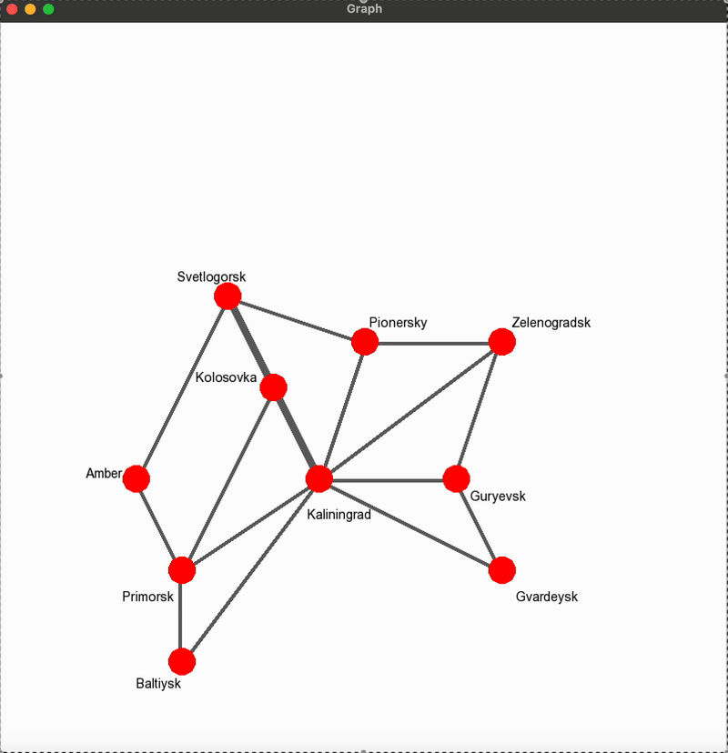

# GraphPathFinder-SFML

GraphPathFinder-SFML is a C++ application that visualizes graphs and computes the shortest path using **Dijkstra’s algorithm**, ensuring traversal through a specific vertex. The project leverages **SFML (Simple and Fast Multimedia Library)** for rendering the graph and displaying the computed path in an interactive window.

## Features
✅ **Graph Visualization** – Displays a graph with nodes (cities) and weighted edges (roads).  
✅ **Adjacency Matrix Construction** – Dynamically builds the graph's adjacency matrix.  
✅ **Dijkstra’s Algorithm Implementation** – Finds the shortest path with an optional required vertex.  
✅ **Interactive Rendering** – Uses **SFML** to visually highlight paths and nodes.  
✅ **Export Results** – Saves computed paths to `outVertex.txt` and `outEdge.txt`.  

## Technologies Used
- **C++**
- **SFML** (for graphics and visualization)
- **Graph Theory Algorithms**

